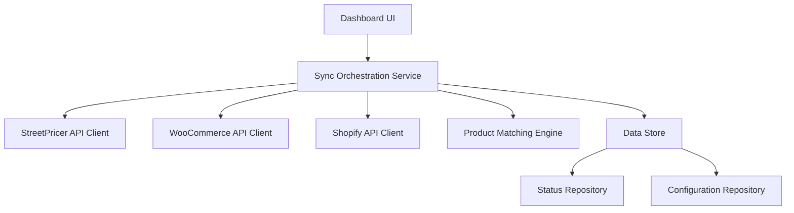

# Design Document

## Overview

The Price Sync Dashboard is a web application that automates product pricing synchronization between the StreetPricer API and multiple e-commerce platforms (WooCommerce and Shopify). The system periodically fetches pricing data from StreetPricer, matches products across platforms using identifiers (SKU or product ID), updates prices via platform APIs, and provides a real-time dashboard for monitoring synchronization status.

The application follows a service-oriented architecture with clear separation between data fetching, product matching, price updating, and presentation layers. This design ensures maintainability, testability, and the ability to add new e-commerce platforms in the future.

## Architecture

### High-Level Architecture



### Technology Stack

- **Backend**: Node.js with TypeScript
- **API Clients**: Axios for HTTP requests
- **Data Storage**: SQLite for local persistence (can be upgraded to PostgreSQL)
- **Frontend**: React with TypeScript
- **Styling**: Tailwind CSS
- **Authentication**: Environment variables for API credentials, encrypted at rest

### Key Design Decisions

1. **Polling vs Webhooks**: The system uses scheduled polling from StreetPricer API since webhook support is not mentioned in their documentation
2. **Product Matching Strategy**: Uses SKU as primary identifier, with fallback to product name similarity matching
3. **Error Handling**: Failed price updates are marked as "pending" and retried on next sync cycle
4. **Idempotency**: Price updates only occur when there's an actual price difference to minimize API calls

## Components and Interfaces

### 1. StreetPricer API Client

**Responsibility**: Fetch product pricing data from StreetPricer API

**Interface**:
```typescript
interface IStreetPricerClient {
  authenticate(): Promise<void>;
  fetchAllProducts(): Promise<StreetPricerProduct[]>;
  fetchProductsByCategory(category: string): Promise<StreetPricerProduct[]>;
}

interface StreetPricerProduct {
  id: string;
  sku: string;
  name: string;
  price: number;
  currency: string;
  lastUpdated: Date;
}
```

### 2. WooCommerce API Client

**Responsibility**: Interact with WooCommerce REST API for product retrieval and price updates

**Interface**:
```typescript
interface IWooCommerceClient {
  authenticate(storeUrl: string, consumerKey: string, consumerSecret: string): Promise<void>;
  getAllProducts(): Promise<WooCommerceProduct[]>;
  updateProductPrice(productId: number, price: number): Promise<void>;
}

interface WooCommerceProduct {
  id: number;
  sku: string;
  name: string;
  price: string;
  regularPrice: string;
}
```

### 3. Shopify API Client

**Responsibility**: Interact with Shopify REST API for product retrieval and price updates

**Interface**:
```typescript
interface IShopifyClient {
  authenticate(shopDomain: string, accessToken: string): Promise<void>;
  getAllProducts(): Promise<ShopifyProduct[]>;
  updateProductPrice(productId: number, variantId: number, price: number): Promise<void>;
}

interface ShopifyProduct {
  id: number;
  variants: ShopifyVariant[];
}

interface ShopifyVariant {
  id: number;
  sku: string;
  title: string;
  price: string;
}
```

### 4. Product Matching Engine

**Responsibility**: Match StreetPricer products with e-commerce platform products using SKU as the common identifier

**Interface**:
```typescript
interface IProductMatcher {
  matchProducts(
    streetPricerProducts: StreetPricerProduct[],
    platformProducts: (WooCommerceProduct | ShopifyVariant)[]
  ): ProductMatchResult;
}

interface ProductMatchResult {
  matched: ProductMatch[];
  unlisted: StreetPricerProduct[];
}

interface ProductMatch {
  streetPricerProduct: StreetPricerProduct;
  platformProduct: WooCommerceProduct | ShopifyVariant;
  matchConfidence: number; // 0-1 score
}
```

**Matching Algorithm**:

SKU is the primary and required matching field across all systems (StreetPricer, WooCommerce, and Shopify). All products must have a SKU field for matching to occur.

1. Exact SKU match (confidence: 1.0) - Case-sensitive comparison
2. Normalized SKU match (confidence: 0.9) - Remove spaces, hyphens, convert to lowercase
3. Products without SKU are automatically categorized as unlisted

### 5. Sync Orchestration Service

**Responsibility**: Coordinate the entire synchronization workflow

**Interface**:
```typescript
interface ISyncService {
  syncAllStores(): Promise<SyncResult>;
  syncStore(storeId: string): Promise<StoreSyncResult>;
  getLastSyncStatus(storeId: string): Promise<SyncStatus>;
}

interface SyncResult {
  stores: StoreSyncResult[];
  startTime: Date;
  endTime: Date;
  overallStatus: 'success' | 'partial' | 'failed';
}

interface StoreSyncResult {
  storeId: string;
  storeName: string;
  platform: 'woocommerce' | 'shopify';
  repricedCount: number;
  pendingCount: number;
  unlistedCount: number;
  errors: SyncError[];
  timestamp: Date;
}

interface SyncError {
  productId: string;
  errorMessage: string;
  errorType: 'authentication' | 'network' | 'validation' | 'api_limit';
}
```

**Workflow**:
1. Fetch products from StreetPricer API
2. For each configured store:
   - Authenticate with platform API
   - Fetch all products from platform
   - Match products using Product Matching Engine
   - Identify price differences
   - Update prices for matched products with differences
   - Record results (repriced, pending, unlisted)
3. Persist sync status to database
4. Return aggregated results

### 6. Status Repository

**Responsibility**: Persist and retrieve synchronization status data

**Interface**:
```typescript
interface IStatusRepository {
  saveSyncResult(result: StoreSyncResult): Promise<void>;
  getLatestSyncStatus(storeId: string): Promise<StoreSyncResult | null>;
  getSyncHistory(storeId: string, limit: number): Promise<StoreSyncResult[]>;
  updateProductStatus(storeId: string, productId: string, status: ProductStatus): Promise<void>;
}

interface ProductStatus {
  productId: string;
  status: 'repriced' | 'pending' | 'unlisted';
  lastAttempt: Date;
  lastSuccess: Date | null;
  errorMessage: string | null;
}
```

### 7. Configuration Repository

**Responsibility**: Manage store configurations and API credentials

**Interface**:
```typescript
interface IConfigRepository {
  getStoreConfig(storeId: string): Promise<StoreConfig>;
  getAllStoreConfigs(): Promise<StoreConfig[]>;
  saveStoreConfig(config: StoreConfig): Promise<void>;
  deleteStoreConfig(storeId: string): Promise<void>;
}

interface StoreConfig {
  storeId: string;
  storeName: string;
  platform: 'woocommerce' | 'shopify';
  credentials: EncryptedCredentials;
  syncInterval: number; // minutes
  enabled: boolean;
}

interface EncryptedCredentials {
  encrypted: string; // AES-256 encrypted JSON
  iv: string;
}
```

### 8. Dashboard UI

**Responsibility**: Display synchronization status and metrics for all stores

**Components**:
- **StoreCard**: Displays metrics for a single store (repriced, pending, unlisted counts)
- **SyncStatusIndicator**: Shows last sync timestamp and status
- **ProductList**: Detailed view of products by status category
- **SyncTrigger**: Manual sync button for on-demand synchronization
- **StoreConfiguration**: Form for adding/editing store credentials

## Data Models

### Database Schema

```sql
-- Stores table
CREATE TABLE stores (
  id TEXT PRIMARY KEY,
  name TEXT NOT NULL,
  platform TEXT NOT NULL CHECK(platform IN ('woocommerce', 'shopify')),
  credentials_encrypted TEXT NOT NULL,
  credentials_iv TEXT NOT NULL,
  sync_interval INTEGER DEFAULT 60,
  enabled BOOLEAN DEFAULT 1,
  created_at DATETIME DEFAULT CURRENT_TIMESTAMP,
  updated_at DATETIME DEFAULT CURRENT_TIMESTAMP
);

-- Sync history table
CREATE TABLE sync_history (
  id INTEGER PRIMARY KEY AUTOINCREMENT,
  store_id TEXT NOT NULL,
  repriced_count INTEGER DEFAULT 0,
  pending_count INTEGER DEFAULT 0,
  unlisted_count INTEGER DEFAULT 0,
  status TEXT NOT NULL CHECK(status IN ('success', 'partial', 'failed')),
  error_message TEXT,
  started_at DATETIME NOT NULL,
  completed_at DATETIME NOT NULL,
  FOREIGN KEY (store_id) REFERENCES stores(id)
);

-- Product status table
CREATE TABLE product_status (
  id INTEGER PRIMARY KEY AUTOINCREMENT,
  store_id TEXT NOT NULL,
  platform_product_id TEXT NOT NULL,
  streetpricer_product_id TEXT NOT NULL,
  sku TEXT,
  status TEXT NOT NULL CHECK(status IN ('repriced', 'pending', 'unlisted')),
  last_attempt DATETIME NOT NULL,
  last_success DATETIME,
  error_message TEXT,
  current_price REAL,
  target_price REAL,
  FOREIGN KEY (store_id) REFERENCES stores(id),
  UNIQUE(store_id, platform_product_id)
);

-- Indexes
CREATE INDEX idx_sync_history_store_id ON sync_history(store_id);
CREATE INDEX idx_sync_history_completed_at ON sync_history(completed_at DESC);
CREATE INDEX idx_product_status_store_id ON product_status(store_id);
CREATE INDEX idx_product_status_status ON product_status(status);
```

## Data Models

### TypeScript Models

```typescript
// Core domain models
type Platform = 'woocommerce' | 'shopify';
type SyncStatus = 'success' | 'partial' | 'failed';
type ProductSyncStatus = 'repriced' | 'pending' | 'unlisted';

interface Store {
  id: string;
  name: string;
  platform: Platform;
  syncInterval: number;
  enabled: boolean;
  createdAt: Date;
  updatedAt: Date;
}

interface SyncHistoryRecord {
  id: number;
  storeId: string;
  repricedCount: number;
  pendingCount: number;
  unlistedCount: number;
  status: SyncStatus;
  errorMessage?: string;
  startedAt: Date;
  completedAt: Date;
}

interface ProductStatusRecord {
  id: number;
  storeId: string;
  platformProductId: string;
  streetpricerProductId: string;
  sku: string;
  status: ProductSyncStatus;
  lastAttempt: Date;
  lastSuccess?: Date;
  errorMessage?: string;
  currentPrice: number;
  targetPrice: number;
}
```


## Correctness Properties

*A property is a characteristic or behavior that should hold true across all valid executions of a system-essentially, a formal statement about what the system should do. Properties serve as the bridge between human-readable specifications and machine-verifiable correctness guarantees.*

After analyzing the acceptance criteria, I've identified several properties that can be consolidated to avoid redundancy. Many requirements are platform-specific (WooCommerce vs Shopify) but test the same underlying behavior, so they can be combined into single properties that work across platforms.

### Property 1: API data retrieval completeness
*For any* valid StreetPricer API response containing N products, fetching all products should result in exactly N products being retrieved by the system.
**Validates: Requirements 1.1**

### Property 2: Data parsing round-trip consistency
*For any* valid StreetPricer API response, parsing the data and then serializing it back should preserve all required fields (product identifier, price, SKU, name).
**Validates: Requirements 1.2**

### Property 3: Retry policy adherence
*For any* API request failure, the system should log the error and attempt retries according to the configured retry policy (max attempts, backoff strategy).
**Validates: Requirements 1.3**

### Property 4: Product data validation
*For any* product record, validation should accept it if and only if it contains all required fields (product identifier and price), rejecting records with missing required fields.
**Validates: Requirements 1.4**

### Property 5: Product matching by SKU
*For any* StreetPricer product with SKU S and any e-commerce platform product with SKU S (exact or normalized match), the matching engine should identify them as a match. SKU is the required common field across all systems.
**Validates: Requirements 2.1, 3.1**

### Property 6: Mapping record creation
*For any* matched product pair, a mapping record should be created that correctly links the StreetPricer product ID to the platform product ID.
**Validates: Requirements 2.2, 3.2**

### Property 7: Unlisted product categorization
*For any* StreetPricer product that has no matching product in a platform store, the system should categorize it as "unlisted" for that store.
**Validates: Requirements 2.3, 3.3**

### Property 8: Product count invariant
*For any* completed matching operation, the sum of matched products and unlisted products should equal the total number of StreetPricer products processed.
**Validates: Requirements 2.4, 3.4**

### Property 9: Price update on difference detection
*For any* matched product pair where the StreetPricer price differs from the platform price, the system should send a price update request to the platform API.
**Validates: Requirements 4.1, 5.1**

### Property 10: Successful update recording
*For any* successful price update operation, the system should record the product status as "repriced" with a timestamp of the update.
**Validates: Requirements 4.2, 5.2**

### Property 11: Failed update handling
*For any* failed price update operation, the system should mark the product status as "pending" and log the failure reason.
**Validates: Requirements 4.3, 5.3**

### Property 12: Attribute preservation during update
*For any* product price update, all non-price attributes (name, SKU, description, images, etc.) should remain unchanged before and after the update.
**Validates: Requirements 4.4, 5.4**

### Property 13: Dashboard count accuracy
*For any* store, the dashboard should display counts (repriced, pending, unlisted) that exactly match the counts in the data store for that store.
**Validates: Requirements 6.1, 6.2, 6.3, 7.1, 7.2, 7.3**

### Property 14: Timestamp display accuracy
*For any* store with a completed sync operation, the dashboard should display the timestamp that matches the most recent sync completion time in the data store.
**Validates: Requirements 6.4, 7.4**

### Property 15: Authentication credential usage
*For any* API connection attempt, the system should use the configured credentials for that specific API (StreetPricer, WooCommerce, or Shopify).
**Validates: Requirements 8.1, 9.1, 10.1**

### Property 16: Authentication failure handling
*For any* authentication failure, the system should log the error and prevent subsequent API operations for that service until authentication succeeds.
**Validates: Requirements 8.2, 9.2, 10.2**

### Property 17: Credential encryption
*For any* stored API credentials, the data at rest should be encrypted (not plaintext) and should be decryptable back to the original credentials.
**Validates: Requirements 8.3, 9.3, 10.3**

## Error Handling

### Error Categories

1. **Authentication Errors**
   - Invalid credentials
   - Expired tokens
   - Insufficient permissions
   - **Handling**: Log error, mark store as authentication-failed, notify user, prevent further operations

2. **Network Errors**
   - Connection timeout
   - DNS resolution failure
   - Network unreachable
   - **Handling**: Retry with exponential backoff (max 3 attempts), log error, mark products as pending

3. **API Rate Limiting**
   - 429 Too Many Requests
   - **Handling**: Respect Retry-After header, implement exponential backoff, queue requests

4. **Validation Errors**
   - Missing required fields
   - Invalid data types
   - Price out of acceptable range
   - **Handling**: Log validation error, skip product, continue with next product

5. **Data Consistency Errors**
   - Product not found
   - Concurrent modification
   - **Handling**: Log error, mark as pending, retry on next sync cycle

### Error Recovery Strategy

- **Transient Errors**: Automatic retry with exponential backoff
- **Persistent Errors**: Mark as pending, alert user after 3 consecutive failures
- **Critical Errors**: Stop sync operation, alert user immediately
- **Partial Failures**: Continue processing remaining products, report partial success

### Logging Strategy

- **Error Logs**: Include timestamp, error type, error message, stack trace, affected product/store
- **Audit Logs**: Record all price changes with before/after values
- **Performance Logs**: Track API response times, sync duration
- **Log Retention**: 90 days for error logs, 30 days for audit logs

## Testing Strategy

### Unit Testing

The system will use **Jest** as the testing framework for unit tests. Unit tests will cover:

- **API Client Functions**: Mock HTTP responses to test parsing, error handling, and authentication
- **Product Matching Logic**: Test exact matches, fuzzy matches, and edge cases (empty SKU, special characters)
- **Data Validation**: Test validation rules for required fields, data types, and ranges
- **Encryption/Decryption**: Test credential encryption and decryption with various inputs
- **Database Operations**: Test CRUD operations with in-memory SQLite database

### Property-Based Testing

The system will use **fast-check** as the property-based testing library for TypeScript/JavaScript. Property-based tests will:

- Run a minimum of **100 iterations** per property test to ensure thorough coverage
- Each property-based test MUST be tagged with a comment explicitly referencing the correctness property from this design document
- Tag format: `// Feature: price-sync-dashboard, Property {number}: {property_text}`
- Each correctness property MUST be implemented by a SINGLE property-based test

**Property Test Coverage**:

1. **Property 1-4**: Test StreetPricer API client with generated product data
2. **Property 5-8**: Test product matching engine with generated product sets
3. **Property 9-12**: Test price update logic with generated price differences
4. **Property 13-14**: Test dashboard data display with generated sync results
5. **Property 15-17**: Test authentication and encryption with generated credentials

**Generator Strategy**:
- Create smart generators that produce realistic product data (valid SKUs, reasonable prices)
- Generate edge cases (empty strings, very long strings, special characters, negative prices)
- Use shrinking to find minimal failing examples when tests fail

### Integration Testing

Integration tests will verify:
- End-to-end sync workflow from API fetch to database persistence
- API client integration with mock API servers
- Database transactions and rollback behavior
- Error propagation through the system layers

### Test Data Management

- Use factories to generate test data with realistic values
- Maintain separate test databases that are reset between test runs
- Mock external API calls to avoid rate limiting and ensure deterministic tests
- Use snapshot testing for complex data structures (API responses, database records)

## Security Considerations

### Credential Management

- **Storage**: API credentials encrypted using AES-256-GCM with unique IV per record
- **Key Management**: Encryption key stored in environment variable, never in code or database
- **Access Control**: Credentials only decrypted when needed for API calls, never logged
- **Rotation**: Support for credential rotation without system downtime

### API Security

- **HTTPS Only**: All API communications over TLS 1.2+
- **Token Expiration**: Implement token refresh logic for platforms that support it
- **Request Signing**: Use HMAC signatures where supported (WooCommerce)
- **Rate Limiting**: Implement client-side rate limiting to respect API quotas

### Data Privacy

- **PII Handling**: Product data may contain customer information; ensure compliance with data protection regulations
- **Audit Trail**: Log all price changes for accountability
- **Data Retention**: Implement configurable retention policies for sync history

## Performance Considerations

### Optimization Strategies

1. **Batch Operations**: Update multiple products in single API calls where supported
2. **Caching**: Cache product lists with TTL to reduce API calls
3. **Parallel Processing**: Process multiple stores concurrently
4. **Incremental Sync**: Only fetch products updated since last sync (if API supports)
5. **Database Indexing**: Index frequently queried fields (store_id, status, timestamp)

### Scalability

- **Horizontal Scaling**: Stateless design allows multiple instances with shared database
- **Queue-Based Processing**: Use job queue for async sync operations
- **Database Optimization**: Use connection pooling, prepared statements
- **Monitoring**: Track sync duration, API response times, error rates

### Expected Performance

- **Sync Duration**: < 5 minutes for 1000 products per store
- **API Calls**: Minimize calls through caching and batch operations
- **Database Queries**: < 100ms for dashboard data retrieval
- **Memory Usage**: < 512MB per sync operation
